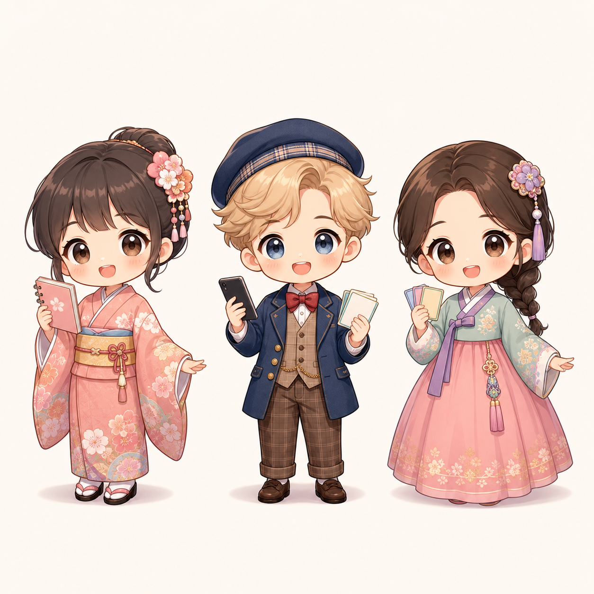

# キャラクター設計書

## 1. 方針

本アプリでは、日本語・英語・韓国語の学習をやさしく支援する案内役として、3人のキャラクターを使用する。

国籍や文化を扱うため、以下の方針を守る。

- 国旗、政治的記号、宗教的記号をキャラクターの主要要素にしない。
- 伝統衣装は、敬意を持って簡略化したマスコット衣装として取り入れる。
- 伝統衣装を笑いや誇張表現として扱わない。
- 肌の色、顔立ち、髪型を固定的なステレオタイプとして扱わない。
- 3頭身程度のかわいいデフォルメで、表情と小物でも個性を出す。
- どの国の利用者が見ても、学習を応援する親しみやすい人物として見えることを優先する。

## 2. キャラクター一覧

キャラクターのコンセプト画像:



左から、日本語担当、英語担当、韓国語担当として使用する。

## 3. 日本語担当キャラクター

### 3.1 基本設定

- 仮名: さくら
- 担当言語: 日本語
- 役割: 日本語の意味確認、やさしい補足、復習の案内
- 印象: 落ち着いていて親しみやすい
- 主な小物: ノート

### 3.2 デザイン方針

- 着物または浴衣を参考にした、簡略化された伝統衣装風デザインにする。
- 花柄や帯などの要素は丁寧に扱い、派手すぎない pastel 調でまとめる。
- 3頭身程度のデフォルメで、学習アプリの案内役として親しみやすくする。

### 3.3 セリフ例

普通:

```text
今日も少しずつ覚えていこう。
```

うれしい:

```text
いいね。意味がしっかりつながってきたよ。
```

悲しい:

```text
大丈夫。間違えた単語ほど覚えやすくなるよ。
```

難しい:

```text
似ている言葉だから、ゆっくり見比べよう。
```

驚き:

```text
すごい、今のはすぐ選べたね。
```

## 4. 英語担当キャラクター

### 4.1 基本設定

- 仮名: Alex
- 担当言語: 英語
- 想定: イギリス人またはアメリカ人として扱える英語圏キャラクター
- 役割: 英単語の確認、自然な表現のヒント、学習ペースの応援
- 印象: 明るくフレンドリー
- 主な小物: スマートフォン、単語カード

### 4.2 デザイン方針

- 英語圏らしさは、国旗や過度な記号ではなく、クラシカルで上品な服装で表現する。
- 初期案では、イギリス風の帽子、ジャケット、ベストなどを参考にした衣装とする。
- アメリカ人キャラクターとして使う場合は、スクール風またはフォーマル風の服装に調整する。
- 肌や髪の色は多様性を前提とし、固定的な国籍表現にしない。

### 4.3 セリフ例

普通:

```text
Let's check the meaning together.
```

うれしい:

```text
Nice! You picked the right pair.
```

悲しい:

```text
Almost there. Try matching the meanings again.
```

難しい:

```text
This one is tricky, so compare each choice carefully.
```

驚き:

```text
Wow, that was quick!
```

## 5. 韓国語担当キャラクター

### 5.1 基本設定

- 仮名: ミン
- 担当言語: 韓国語
- 役割: 韓国語単語の確認、似た意味の単語の注意喚起、復習の応援
- 印象: やさしく、少し頼れる雰囲気
- 主な小物: 単語カード

### 5.2 デザイン方針

- 韓服を参考にした、簡略化された伝統衣装風デザインにする。
- チョゴリ、リボン、スカートの形状などを丁寧に扱い、装飾は上品に抑える。
- 韓国人利用者が見ても自然で、不快感のない表現にする。

### 5.3 セリフ例

普通:

```text
이번 단어도 같이 확인해 보자.
```

うれしい:

```text
좋아. 뜻을 잘 골랐어.
```

悲しい:

```text
괜찮아. 다시 보면 더 잘 기억할 수 있어.
```

難しい:

```text
비슷한 단어가 있으니까 천천히 비교해 보자.
```

驚き:

```text
와, 정말 빠르게 맞혔어.
```

## 6. 表情パターン

各キャラクターには、以下の表情差分を用意する。

- 普通
- うれしい
- 悲しい
- 難しい
- 驚き

初期実装では、3頭身程度の伝統衣装版コンセプト画像を基準に1枚絵として利用する。実装が進んだ段階で、各キャラクターを個別に切り出し、表情差分を作成する。

## 7. アプリ内での使用方針

- ホーム画面では、選択中の基準言語に対応するキャラクターのみを表示する。
- クイズ画面では、正解・不正解・連続正解などに応じて表情とセリフを切り替える。
- キャラクターは学習の主役ではなく、利用者を支援する案内役として控えめに表示する。
- 不正解時のセリフは責める表現にせず、次の学習につながる表現にする。
- 国籍や文化を笑いにするセリフは使用しない。

## 8. 非表示設定

利用者がキャラクター表示を希望しない場合に備え、設定画面でキャラクター表示をOFFにできるようにする。

非表示時の扱い:

- キャラクター画像を表示しない。
- 表情差分を表示しない。
- キャラクターのセリフ枠を表示しない。
- 正解、不正解、結果などの必要な情報は通常のUIテキストとして表示する。
- キャラクター表示エリアの空白が残らないよう、画面レイアウトを詰める。
- 成績管理や学習履歴には影響しない。

## 9. 画像生成時の注意

今後追加画像を作成する場合は、以下をプロンプトに含める。

```text
Create friendly 3-head-tall chibi learning app characters with respectfully simplified traditional clothing. Avoid caricature, stereotypes, flags, political symbols, religious symbols, costume parody, exaggerated national traits, offensive gestures, text, watermark, and logos.
```
